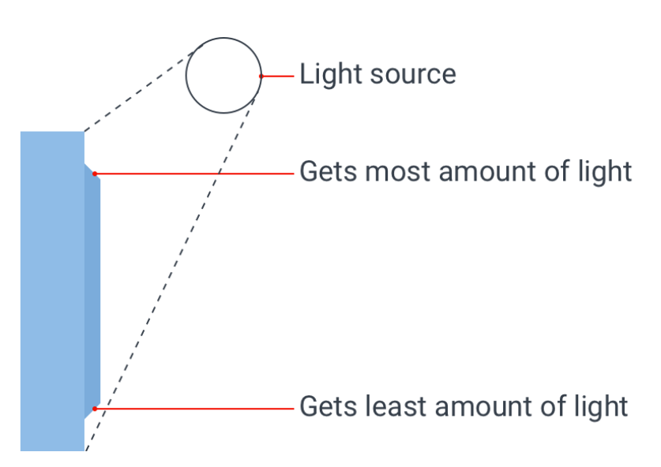
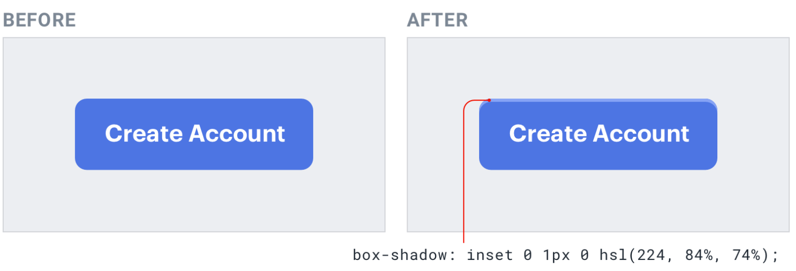
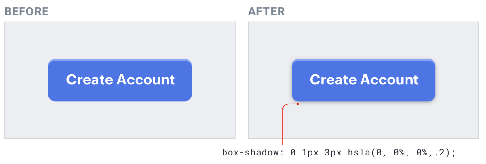

## Part 3 - Designing Text
Most interfaces use way too many **font sizes**. Unless a team has a rigid
design system in place, it’s not uncommon to find that every pixel value from
10px to 24px has been used in the UI somewhere.
Choosing font sizes without a system is a bad idea for two reasons:
1. It leads to annoying inconsistencies in your designs.
2. It slows down your workflow.

Here’s an example of a scale that works well for most projects and aligns
nicely with the spacing and sizing scale recommended in “Establishing a
spacing and sizing system”:
It’s constrained just enough to speed up your decision making, but isn’t so
limited as to make you feel like you’re missing a useful size.
```js
12px , 14px, 16px, 18px, 20px, 24px, 30px, 36px, 48px, 60px, 72px
```
It’s constrained just enough to speed up your decision making, but isn’t so
limited as to make you feel like you’re missing a useful size.

When you’re building a type scale, don’t use **em** units to define your sizes.
Because em units are relative to the current font size, the computed font size
of nested elements is often not actually a value in your scale.

**Stick to px or rem units — it’s the only way to guarantee you’re actually sticking to the system.**

### Use good fonts
Play it safe
For UI design, your safest bet is a fairly **neutral sans-serif** — think something
like Helvetica.
If you really don’t trust your own taste, one great option is to rely on the
system font stack:
```js
-apple-system, Segoe UI, Roboto, Noto Sans, Ubuntu, Cantarell, Helvetica Neue;
```

- Ignore typefaces with less than five weights
- A great way to limit the number of options you have to choose from is to
crank that up to 10+ (to account for italics)
- On **Google Fonts** specifically, that cuts out 85% of the available options,
leaving you with less than 50 sans-serifs to choose from.

- Trust the wisdom of the crowd: If a font is popular, it’s probably a good font. Most font directories will let you
sort by popularity,

- Steal from people who care: Inspect some of your favorite sites and see what typefaces they are using (look for **"font-family"** attribute )

- Keep your line length in check: When styling paragraphs, it’s easy to make the mistake of fitting the text to
your layout instead of trying to create the best reading experience. 
For the best reading experience, **make your paragraphs wide enough to fit between 45 and 75 characters per line** (around 12-13 words per line). 
The easiest way to do this on the web is using em units, which are relative to the current font size. A width of
20-35em will get you in the right ballpark

- Baseline, not center: A better approach is to align mixed font sizes by their baseline, which is the
imaginary line that letters rest on. --> use **align-items: baseline** instead of *align-items: center*.
The result is a simpler, cleaner look than what you get when you center two
pieces of text and offset their baselines.

- Accounting for line length:  your line-height and paragraph width should be
proportional — narrow content can use a shorter line-height like 1.5, but wide
content might need a line-height as tall as 2.
Line-height is proportional 106

- Accounting for font size: When text is small, extra line spacing is important because it makes it a lot
easier for your eyes to find the next line when the text wraps. But as text gets larger, your
 eyes don’t need as much help. 
 This means that for large headline text you might not need any extra line spacing, and a line-height of 1 is perfectly fine.

 **Line-height and font size are *inversely proportional* — use a taller line-height for small text and a shorter line-height for large text**

- Don’t center long form text: Center-alignment can look great for headlines or short, independent blocks
of text.
But if something is longer than two or three lines, it will almost always look better **left-aligned**.

- Right-align numbers: If you’re designing a table that includes numbers, right-align them.

- Whenever you justify text, you should also **enable hyphenation**

### Use letter-spacing effectively
When styling text, a lot of effort is put into getting the **weight**, **color**, and **line-height** just right, 
but it’s easy to forget that **letter-spacing** can be tweaked, too.
As a general rule, you should trust the typeface designer and leave letter-
spacing alone. That said, there are a couple of common situations where adjusting it can improve your designs.
- Tightening headlines
-  it often makes sense to increase the letter-spacing of all-
caps text to improve readability


## Part 4 - Working with Color
#### TailwindCSS - Colors Generator: https://uicolors.app/create
- Ditch hex for HSL: HSL fixes this by representing colors using attributes the human-eye
intuitively perceives: **hue, saturation, and lightness**.
**Hue** is a color’s position on the color wheel — it’s the attribute of a color that
lets us identify two colors as "blue" even if they aren't identical.
Hue is measured in degrees, where 0° is red, 120° is green, and 240° is blue.
**Saturation** is how colorful or vivid a color looks. 0% saturation is grey (no
color), and 100% saturation is vibrant and intense.
Without saturation, hue is irrelevant
**Lightness** is just what it sounds like — it measures how close a color is to
black or to white. 0% lightness is pure black, 100% lightness is pure white,
and 50% lightness is a pure color at the given hue.

#### You need more colors than you think
You can break a good color palette down into three categories.
- **Greys**: Text, backgrounds, panels, form controls — almost everything in an interface
is grey.
In practice, you want 8-10 shades to choose from (more on this in "Define your shades up front")
True black tends to look pretty unnatural, so start with a really dark grey and
work your way up to white in steady increments.

- **Primary color(s)**: Most sites need one, maybe **two colors** that are used for primary actions,
active navigation elements, etc. These are the colors that determine the **overall look of a site**

- **Accent colors**: On top of primary colors, every site needs a few accent colors for
communicating different things to the user.
For example, you might want to use an eye-grabbing color like *yellow*, *pink*, or *teal* 
to highlight a new feature.
You might also need colors to emphasize different semantic states, like *red*
for confirming a destructive action and *yellows* for a warning message. or *green* to highlight a positive trend.

**All in, it’s not uncommon to need as many as ten different colors with 5-10 shades each for a complex UI.**

### Accessible doesn’t have to mean ugly
To make sure your designs are accessible, the Web Content Accessibility Guidelines (WCAG) 
recommend that normal text (under ~18px) has a contrast ratio of at least 4.5:1, and that 
larger text has a contrast ratio of at least 3:1.
For typical dark-text-on-a-light-background situations, meeting this
recommendation is pretty easy, but it gets a lot trickier when you start
working with color.
When using white text on a colored background, you’d be surprised how
dark the color often needs to be to meet that 4.5:1 contrast ratio.
You can solve this problem by flipping the contrast. Instead of using light
text on a dark colored background, use dark colored text on a light colored
background

#### Don't rely on color alone
Color can be a fantastic way to enhance information and make it easier to
understand, but be careful not to rely on it, or users with color blindness will
have a hard time interpreting your UI.
- Take metric cards for example. With this design, someone who is red-green colorblind 
  can't easily tell if a metric has gotten better or worse.
An easy fix for this is to also communicate that information in some other
way, like by **adding icons** to indicate if the change is positive or negative.

- What about something like a graph, where each trend line has a different
color? In situations like this, try relying on contrast instead of using completely
different colors. It's much easier for someone who's colorblind to tell the
difference between light and dark than it is for them to tell the difference
between two distinct colors.
Always use color to support something that your design is already saying, but 
never use it as the only means of communication.


## Part 5 - Creating Depth
- Creating this effect might look complicated at first, but it actually only
requires you to understand one fundamental rule: **Light comes from above**



#### Simulating light in a user interface
- If you want an element to appear raised or inset, first figure out what profile
you want that element to have, then mimic how a light source would interact
with that shape.
Example:
Because the top and bottom edges are both flat, it would be impossible to
see both of them at the same time. People generally look slightly downward
towards their screens, so for the most natural look, reveal a little bit of the
top edge and hide the bottom edge.
Since the top edge is facing upward, make it slightly lighter than the face of
Emulate a light source 153
the button, usually using a top border or an inset box shadow with a slight
vertical offset:


Next, you need to account for the fact that a raised element will block some
of the light from reaching the area below the element.
Do this by adding a small dark box shadow with a slight vertical offset (you
only want the shadow to appear below the element)



#### Use shadows to convey elevation
Shadows can be more than just a flashy effect — used thoughtfully, they let
you position elements on a virtual z-axis to create a meaningful sense of
depth.
The closer something feels to the user, the more it will attract their focus.
- You might use a smaller shadow for something like a button, where you want
the user to notice it but don’t want it to dominate the page
- Medium shadows are useful for things like dropdowns; elements that need
to sit a bit further above the rest of the UI
- Large shadows are great for modal dialogs, where you really want to capture
the user’s attention

#### Establishing an elevation system
- Just like with color, typography, spacing, and sizing, defining a fixed set of
shadows will speed up your workflow and help maintain consistency in your
designs.
You don’t need a ton of different shadows — five options is usually plenty.